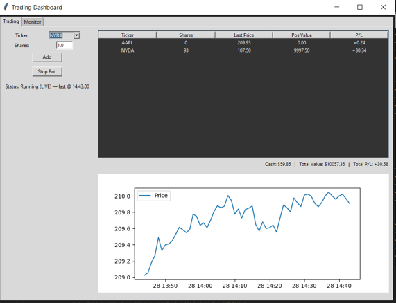

# Trading_bot

**Trading Bot & Sentiment Analysis GUI** is a sleek, all-in-one Tkinter desktop app that lets you **test and refine** moving-average crossover strategies in both live and historical markets. It combines real-time price charts, P/L tracking, and simulated trades for strategy validation—plus integrated VADER/TextBlob sentiment scores from Yahoo Finance headlines to help you make smarter decisions.

## Features

* **Live Trading Mode:** Fetches real-time minute-level stock data and executes simulated trades.
* **Historical Mode:** Simulates trades on past data for a user-specified date.
* **Sentiment Analysis:** Retrieves recent news headlines and computes VADER/TextBlob sentiment scores.
* **Visual Dashboard:** Portfolio table, P/L tracking, and price chart updates.

## Requirements

* Python 3.8 or higher
* Required packages listed in `requirements.txt`

## Installation

```bash
# Step 1:  Clone the repository
git clone https://github.com/rishabh-sinha-stevens/trading_bot.git
cd trading_bot

# Step 2: Install dependencies
pip install -r requirements.txt
```

## Usage

Start the graphical interface:

```bash
python main.py
```

### Trading Tab
* Use the Ticker dropdown and Shares field to add a stock and press the ADD button.
* Click Start Bot and choose Live or Historical mode.
* Monitor portfolio, cash, P/L, and price chart in real time.

### Sentiment Tab
* Select a ticker and click Check Sentiment.
* View news headlines with VADER and TextBlob scores.

## Project Structure

```text
├── main.py            # Launches the GUI
├── GUI.py             # Tkinter application code
├── TradingBot.py      # Trading logic and data fetching
├── SentimentBot.py    # News sentiment analysis
├── requirements.txt   # Python package dependencies
└── README.md          # This documentation
```


